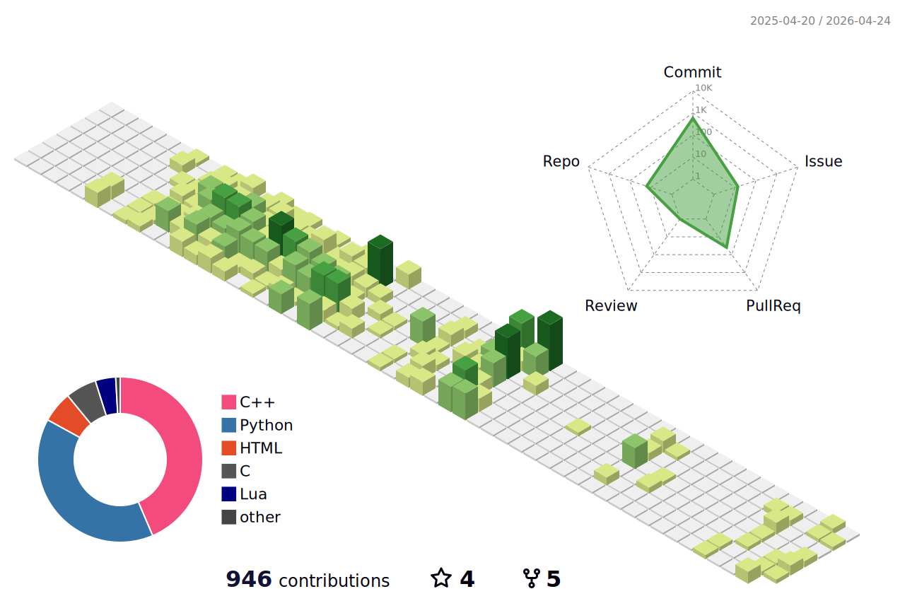

<h1>🔥 Welcome! This is Dev. Paul! 🔥</h1>

#

#### 🧐 Introduce About Me

* Hyeonso Ryu, A.K.A Paul
* 🇰🇷 | Based In Korea
* 💻 | Front-End Developer
* 📱 | Mobile Application Developer
* 📷 | Love Photography
* Korean, English

#

<h4> 🛠 Language & Tech 🛠 </h4>

   
    
    
 
  

<h4> 🛠 Editor & IDE 🛠 </h4>
    

  
  

  
#

#

<h4> 📞 Contact 📞 </h4>

 

#

#
